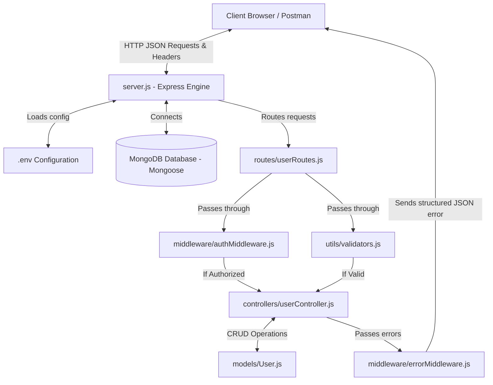

# DecodeLabs Project 2: Industrial-Grade Backend API Development

An industrial-grade, secure, scalable, and well-documented REST API built using the **MERN Stack** (specifically Node.js, Express.js, MongoDB, and Mongoose). This project implements secure authentication using JSON Web Tokens (JWT), role-based authorization, robust input validation, and centralized error handling.

---

## 1. Project Overview

This backend API serves as the core engine for user management in a web application. It is structured around the **Gatekeeper Rule**, which dictates that **no client input can be trusted**. 

### Core Features:
- **RESTful Endpoints**: Full CRUD (Create, Read, Update, Delete) operations using clean, noun-based routing.
- **Data Validation**: Strict validations on email formats, password lengths, name lengths, roles, and MongoDB ObjectId structures.
- **Robust Security**: Password hashing with `bcryptjs`, secure token-based authentication via `jsonwebtoken` (JWT), and CORS integration.
- **Role-Based Authorization**: Distinct access levels for `user` and `admin` roles, where destructive actions (like deleting a user) are restricted to administrators.
- **Centralized Error Handling**: Unified error parsing middleware that guarantees JSON-formatted error responses for all scenarios (including database validation failures, duplicate keys, and resource-not-found errors).

---

## 2. System Architecture

The project follows the standard **Model-View-Controller (MVC)** architectural pattern (with the "View" being represented by JSON responses rendered to the client):



---

## 3. Database Schema

The database model is defined via a Mongoose Schema in [models/User.js](file:///c:/Users/guru6/OneDrive/Desktop/DECODE%20LABS/PROJECT2/backend-api/models/User.js). 

| Field | Type | Rules / Validations | Default Value | Description |
| :--- | :--- | :--- | :--- | :--- |
| `_id` | `ObjectId` | Generated automatically by MongoDB | | Unique identifier |
| `name` | `String` | Required, trimmed, min 3 chars, max 50 chars | | Full name of the user |
| `email` | `String` | Required, unique, lowercase, regex email format | | Login email address |
| `password` | `String` | Required, hashed (using `bcryptjs`), min 8 chars | | Hashed security password |
| `role` | `String` | Enum: `['user', 'admin']` | `'user'` | Access control role |
| `createdAt`| `Date` | Timestamp generated by Mongoose | | Registration time |
| `updatedAt`| `Date` | Timestamp generated by Mongoose | | Last updated time |

---

## 4. Folder Structure

The project has been modularized into specific folders based on responsibility:

```
backend-api/
│
├── server.js              # Express app initialization, middleware mounting, and server listener
├── package.json           # Project dependencies, metadata, and execution scripts
├── .env                   # Configuration file for ports, database URIs, and JWT secrets
├── .gitignore             # Tells Git which files to ignore (e.g. node_modules, .env)
├── README.md              # Project documentation (this file)
│
├── config/
│   └── db.js              # MongoDB connection setup using Mongoose
│
├── models/
│   └── User.js            # User Schema, pre-save hashing hooks, and comparison methods
│
├── routes/
│   └── userRoutes.js      # RESTful route definitions and routing guards
│
├── controllers/
│   └── userController.js  # Request handlers containing business logic (CRUD & Auth)
│
├── middleware/
│   ├── authMiddleware.js  # JWT validation (`protect`) and role verification (`admin`)
│   └── errorMiddleware.js # Centralized 404 route and error formatter
│
└── utils/
    └── validators.js      # Input check helpers implementing the Gatekeeper rule
```

---

## 5. Complete Code Structure

### 5.1 Entry Point: `server.js`
Ties together all components, manages configurations, and sets up listener.
* **Path**: [server.js](file:///c:/Users/guru6/OneDrive/Desktop/DECODE%20LABS/PROJECT2/backend-api/server.js)

### 5.2 Database Config: `config/db.js`
Handles connection to MongoDB asynchronously.
* **Path**: [config/db.js](file:///c:/Users/guru6/OneDrive/Desktop/DECODE%20LABS/PROJECT2/backend-api/config/db.js)

### 5.3 User Model: `models/User.js`
Handles MongoDB modeling, automated timestamps, pre-save password hashing, and password comparison.
* **Path**: [models/User.js](file:///c:/Users/guru6/OneDrive/Desktop/DECODE%20LABS/PROJECT2/backend-api/models/User.js)

### 5.4 Input Validators: `utils/validators.js`
Pure Javascript validation helper functions to enforce lengths, formats, and schemas.
* **Path**: [utils/validators.js](file:///c:/Users/guru6/OneDrive/Desktop/DECODE%20LABS/PROJECT2/backend-api/utils/validators.js)

### 5.5 Authentication & Authorization Middleware: `middleware/authMiddleware.js`
Secures endpoints with JWT token validation and blocks access to non-admin roles for restricted endpoints.
* **Path**: [middleware/authMiddleware.js](file:///c:/Users/guru6/OneDrive/Desktop/DECODE%20LABS/PROJECT2/backend-api/middleware/authMiddleware.js)

### 5.6 Error Handler Middleware: `middleware/errorMiddleware.js`
Standardizes all error structures so the API always responds in JSON format.
* **Path**: [middleware/errorMiddleware.js](file:///c:/Users/guru6/OneDrive/Desktop/DECODE%20LABS/PROJECT2/backend-api/middleware/errorMiddleware.js)

### 5.7 Route Mappings: `routes/userRoutes.js`
Maps URIs directly to controller logic.
* **Path**: [routes/userRoutes.js](file:///c:/Users/guru6/OneDrive/Desktop/DECODE%20LABS/PROJECT2/backend-api/routes/userRoutes.js)

### 5.8 Business Controller: `controllers/userController.js`
Encapsulates all logic including signup, token generation, profile lookup, and modification.
* **Path**: [controllers/userController.js](file:///c:/Users/guru6/OneDrive/Desktop/DECODE%20LABS/PROJECT2/backend-api/controllers/userController.js)

---

## 6. API Endpoint Documentation

### Base URL
`http://localhost:5000`

### 6.1 Authentication Endpoints

#### Register a New User
* **Endpoint**: `/api/users`
* **Method**: `POST`
* **Description**: Registers a new user. Default role is `'user'`.
* **Headers**: `Content-Type: application/json`
* **Request Body**:
  ```json
  {
    "name": "John Doe",
    "email": "johndoe@example.com",
    "password": "securepassword123",
    "role": "user"
  }
  ```
* **Status Codes**: 
  - `201 Created` (Success)
  - `400 Bad Request` (Validation error, e.g. name too short, invalid email, short password)
  - `409 Conflict` (Email already registered)
  - `500 Internal Server Error`

#### User Login
* **Endpoint**: `/api/users/login`
* **Method**: `POST`
* **Description**: Verifies credentials and generates a JWT.
* **Headers**: `Content-Type: application/json`
* **Request Body**:
  ```json
  {
    "email": "johndoe@example.com",
    "password": "securepassword123"
  }
  ```
* **Status Codes**:
  - `200 OK` (Success, returns user details and token)
  - `400 Bad Request` (Missing fields or invalid email format)
  - `401 Unauthorized` (Incorrect email or password)

---

### 6.2 User Management CRUD Endpoints (Protected)

> [!NOTE]
> All endpoints below require a valid JWT token passed in the request header:
> `Authorization: Bearer <your_jwt_token>`

#### Get All Users
* **Endpoint**: `/api/users`
* **Method**: `GET`
* **Description**: Lists details of all registered users (passwords excluded).
* **Security**: Protected (Requires any logged-in user token)
* **Status Codes**:
  - `200 OK` (Success)
  - `401 Unauthorized` (No token, or token expired/invalid)

#### Get Single User by ID
* **Endpoint**: `/api/users/:id`
* **Method**: `GET`
* **Description**: Retrieves data for a specific user.
* **Security**: Protected (Requires any logged-in user token)
* **URL Parameter**: `id` - Valid 24-character MongoDB ObjectId
* **Status Codes**:
  - `200 OK` (Success)
  - `400 Bad Request` (Invalid ObjectId format)
  - `401 Unauthorized` (Invalid/missing token)
  - `404 Not Found` (No user exists with this ID)

#### Update User Details
* **Endpoint**: `/api/users/:id`
* **Method**: `PUT`
* **Description**: Modifies select fields (`name`, `email`, `password`, `role`). If updating a password, it hashes it automatically.
* **Security**: Protected (Requires any logged-in user token)
* **URL Parameter**: `id` - Valid MongoDB ObjectId
* **Request Body (Optional fields)**:
  ```json
  {
    "name": "John Updated",
    "email": "johnnew@example.com"
  }
  ```
* **Status Codes**:
  - `200 OK` (Success, returns updated user object)
  - `400 Bad Request` (Invalid ObjectId or invalid field values)
  - `401 Unauthorized` (Invalid/missing token)
  - `404 Not Found` (User not found)
  - `409 Conflict` (Updated email is already in use by another user)

#### Delete User (Admin Only)
* **Endpoint**: `/api/users/:id`
* **Method**: `DELETE`
* **Description**: Deletes a user record permanently.
* **Security**: Protected **AND** restricted to the `admin` role.
* **URL Parameter**: `id` - Valid MongoDB ObjectId
* **Status Codes**:
  - `200 OK` (Success, user deleted)
  - `400 Bad Request` (Invalid ObjectId format)
  - `401 Unauthorized` (Invalid/missing token)
  - `403 Forbidden` (User is authenticated, but is NOT an admin)
  - `404 Not Found` (User not found)

---

## 7. Sample API Requests & Responses

### 7.1 Success Response Example (Register User)
**POST** `/api/users`
```json
{
  "success": true,
  "message": "User registered successfully",
  "data": {
    "_id": "66601b0b7fa9d2b70f1a90c5",
    "name": "John Doe",
    "email": "johndoe@example.com",
    "role": "user",
    "token": "eyJhbGciOiJIUzI1NiIsInR5cCI6IkpXVCJ9.eyJpZCI6IjY2NjAxYjBiN2ZhOWQyYjcwZjFhOTBjNSIsImlhdCI6MTcxNzU3NDQwMCwiZXhwIjoxNzIwMTY2NDAwfQ...",
    "createdAt": "2026-06-05T16:30:00.123Z",
    "updatedAt": "2026-06-05T16:30:00.123Z"
  }
}
```

### 7.2 Validation Error Response Example
**POST** `/api/users` with missing `email` field:
```json
{
  "success": false,
  "message": "Email is required"
}
```

### 7.3 Authorization Denied Response Example (Accessing Admin Route with User Token)
**DELETE** `/api/users/66601b0b7fa9d2b70f1a90c5` using a non-admin token:
```json
{
  "success": false,
  "message": "Not authorized as an admin: Access denied"
}
```

---

## 8. Postman Testing Steps

To test this API using Postman, follow these steps:

1. **Import/Create requests in Postman**:
   Create a new collection named `DecodeLabs API` and add requests matching the endpoints above.
   
2. **Register a User**:
   - Create a request: `POST http://localhost:5000/api/users`
   - Select **Body** -> **raw** -> **JSON**.
   - Input register JSON payload (refer to section 6.1) and hit **Send**.
   - Copy the `"token"` value from the response.

3. **Log In**:
   - Create a request: `POST http://localhost:5000/api/users/login`
   - Select **Body** -> **raw** -> **JSON**.
   - Input email and password, then hit **Send** to verify you receive a login token.

4. **Verify Route Protection (Get All Users)**:
   - Create a request: `GET http://localhost:5000/api/users`
   - Hit **Send** without headers. You should receive a `401 Unauthorized` with the message `"Not authorized: No token provided"`.
   - Now, go to the **Auth** tab in Postman.
   - Choose **Bearer Token** from the Type dropdown.
   - Paste the copied token into the **Token** input field and click **Send**.
   - You should receive `200 OK` along with the list of users.

5. **Test Role Gating (Delete Route)**:
   - Registers a second user (e.g. `user2`). Copy their ID.
   - Create a request: `DELETE http://localhost:5000/api/users/<user2_id>`
   - Authenticate with the token of the first user (whose role is `user`).
   - Click **Send**. You should receive `403 Forbidden` with `"Not authorized as an admin: Access denied"`.
   - Now register or modify an admin user (e.g., change `role` to `admin` in MongoDB directly or by registering with `"role": "admin"`).
   - Use the Admin user's token in the Bearer Token section and hit **Send**.
   - You should receive `200 OK` with `"User deleted successfully"`.

---

## 9. Setup & Run Commands

Follow these steps to run the API locally on your Windows machine:

### Prerequisites:
1. **Node.js** installed (version 16+ recommended).
2. **MongoDB Community Server** installed and running locally on port `27017` (or use a remote MongoDB Atlas connection string).

### Step-by-Step Installation:

1. **Navigate to the Project Directory**:
   ```powershell
   cd "c:\Users\guru6\OneDrive\Desktop\DECODE LABS\PROJECT2\backend-api"
   ```

2. **Install Node Packages**:
   This reads `package.json` and installs all listed dependencies:
   ```powershell
   npm install
   ```

3. **Configure Environment Variables**:
   Open the `.env` file and verify that the connection details match your MongoDB setup:
   - Local MongoDB: `MONGO_URI=mongodb://127.0.0.1:27017/decodelabs_db`
   - Remote Atlas: Replace with your Atlas connection string `mongodb+srv://...`

4. **Run Server in Development Mode**:
   Uses `nodemon` to automatically restart the server whenever files are modified:
   ```powershell
   npm run dev
   ```
   *Expected Console Output:*
   ```
   [Database] MongoDB Connected Successfully: 127.0.0.1
   [Server] Running in development mode on port 5000
   [Server] Access URL: http://localhost:5000
   ```

5. **Run Server in Production Mode**:
   Starts the server normally without nodemon monitoring:
   ```powershell
   npm start
   ```

---

## 10. GitHub Upload Steps

To upload your completed project to your GitHub repository, execute the following commands in your project terminal:

1. **Initialize Git Repository**:
   Make sure you are in the `backend-api` directory:
   ```powershell
   git init
   ```

2. **Add Files to Staging**:
   This adds all files except those defined in `.gitignore` (i.e. `node_modules` and `.env` are safely ignored):
   ```powershell
   git add .
   ```

3. **Create the Initial Commit**:
   ```powershell
   git commit -m "Initial commit: DecodeLabs Backend API Project"
   ```

4. **Create a Main Branch**:
   ```powershell
   git branch -M main
   ```

5. **Link to GitHub Remote Repository**:
   Replace `your-username` and `your-repository-name` with your actual GitHub details:
   ```powershell
   git remote add origin https://github.com/your-username/your-repository-name.git
   ```

6. **Push to GitHub**:
   ```powershell
   git push -u origin main
   ```
